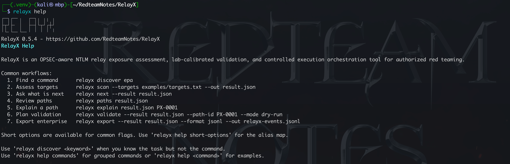

# RelayX

[English](README.md) | [中文](docs/README.zh-CN.md) | [Français](docs/README.fr.md)

**An OPSEC-aware NTLM relay exposure assessment, lab-calibrated validation, and controlled execution orchestration tool for authorized red teaming.**

<p>
  
  
  
  <a href="LICENSE"></a>
</p>


RelayX is an OPSEC-aware Python tool for authorized red team and security
assessment work. It combines NTLM relay exposure assessment, lab-calibrated
validation, and controlled execution orchestration across common enterprise
services. It models source-to-target relay paths, ranks paths by evidence and
operational risk, records guarded validation decisions, and exports results
for operator, defender, and reporting workflows.

RelayX is inspired by Impacket's `ntlmrelayx` and the broader NTLM relay
research ecosystem. It does not try to replace those projects. Its role is to
make relay readiness, prioritization, calibration, execution control, and
remediation analysis available from one evidence-backed result model.

By default RelayX does not capture credentials, forward NTLM authentication, or
execute source-side coercion. Target probes are readiness oriented. Optional
synthetic authentication validation is explicit and may create failed-logon
telemetry.

<p align="center">
  
</p>

## Capabilities

- Protocol readiness assessment for SMB signing, HTTP/HTTPS NTLM, LDAP/LDAPS,
  and MSSQL TDS/SSPI.
- NTLM Type1/Type2 challenge-flow evidence for HTTP, LDAP/LDAPS, and MSSQL
  without credential submission.
- TDS-wrapped TLS negotiation for MSSQL and `tls-server-end-point` CBT
  evidence when server TLS completes.
- Optional synthetic Type3 authentication validation for HTTP, LDAP/LDAPS, and
  MSSQL where supported, used to observe rejection semantics under explicit
  authorization.
- Conservative response classification through shared evidence keys, including
  target-specific reasoning for EPA, LDAP signing, LDAPS CBT, and MSSQL
  encryption/EPA states.
- Protocol oracle hardening with response subclassification, policy inference,
  sanitized oracle signatures, normalized observations, and remaining
  uncertainty for calibration and diff workflows.
- Source capability modeling for WebClient/WebDAV, Spooler, EFSRPC, DFSNM,
  FSRVP, MSSQL outbound authentication, ADIDNS, ghost SPN, and name-resolution
  inducement.
- Source-to-target path construction with scope guardrails, route and pivot
  awareness, noise filtering, blockers, fixes, and OPSEC notes.
- Route/Pivot Awareness for source sessions, segments, subnets, structured
  `route_hops`, Ligolo, Sliver P2P, SOCKS, tun2socks, port forwarding, hop
  count, reachability state, route risk scoring, and optional authorized direct
  TCP reachability checks that do not open pivot sessions.
- Relay decision calculus with rule IDs, target families, preconditions,
  hardening gates, defensive controls, and remediation priorities.
- Lab calibration profiles for HTTP/IIS EPA, AD CS Web Enrollment EPA, LDAP
  signing, LDAPS CBT, and MSSQL encryption/EPA policy states.
- Baseline comparison for lab profiles, including explanations for why a
  finding can be promoted or must remain conservative.
- Lab signature corpus extraction and generated calibration profile drafts for
  repeatable red/blue exercise research.
- Standard lab matrix planning and corpus coverage verification for HTTP/IIS
  EPA, AD CS Web Enrollment EPA, LDAP signing, LDAPS CBT, and MSSQL
  encryption/EPA states.
- Lab corpus provenance review for synthetic fixture marking, authorized lab
  capture metadata, endpoint build metadata, drift baselines, and operator
  promotion decisions.
- Lab response differential analysis for stable policy-state pairs, including
  discriminator keys, context-only differences, and promotion support.
- Evidence completeness reporting for finding/path records, including protocol
  judgement fields, source taxonomy, confidence distribution, missing contract
  keys, and remaining uncertainty.
- Guarded validation and execution records with dry-run, armed, and confirmed
  modes, operator context, timebox/noise/scope checks, and JSONL audit logs.
- Source validation planning for WebClient/WebDAV, RPC coercion surfaces,
  MSSQL outbound authentication, and name-resolution paths without executing
  source triggers.
- OPSEC policy evaluation for validation, execution, and source planning,
  including noise ceilings, scope requirements, confirmed-mode context,
  network-action boundaries, expected telemetry, and rollback checks.
- Operation controls for assessment and validation, including rate limits,
  delay, jitter, scheduled operation windows, listener/callback scope contracts,
  and machine-clean output preservation.
- Execution module inventory, compatibility planning, and Adapter SDK
  dispatch, including built-in offline audit recording, JSON manifest-backed
  module definitions, credential policy guardrails, listener policy guardrails,
  lab-only adapter fixtures that hard-fail in confirmed mode,
  one-shot/timeout/evidence-capture contracts, and audited adapter lifecycle
  records.
- Versioned schema and evidence contract validation for result files, lab
  profiles, corpuses, lab stability and differential reports, execution
  records, evidence reports, module manifests, OpenGraph, JSONL, CSV, OPSEC
  policy, and route report artifacts.
- Enterprise outputs for graph analysis, SIEM ingestion, spreadsheet review,
  HTML/Markdown reporting, scan diffing, and remediation impact simulation.
- Enterprise bundle generation with manifest, artifact hashes, schema status,
  optional route report, and release-ready handoff metadata.
- CI and release quality gates for package metadata, schema contracts, JSON
  fixtures, enterprise docs, GitHub workflows, wheel builds, and install smoke
  tests.
- Short option aliases for common CLI flags, with curated help that explains
  when short forms are convenient and when long forms are clearer.

## Install

RelayX requires Python 3.11 or newer.

```bash
git clone https://github.com/RedteamNotes/RelayX.git
cd RelayX

python3 -m venv .venv && source .venv/bin/activate
python -m pip install --upgrade pip
python -m pip install -e .

relayx --version
```

For a user-level CLI install:

```bash
pipx install git+https://github.com/RedteamNotes/RelayX.git
relayx --version
```

## Quick Start

Run a target assessment and write a RelayX result file:

```bash
relayx scan --targets examples/targets.txt --out result.json
relayx summary result.json
relayx matrix result.json
```

Add source profiles, scope policy, and an enterprise workflow profile:

```bash
relayx scan \
  --profile enterprise \
  --targets examples/targets.txt \
  --sources examples/sources.csv \
  --scope examples/scope.txt \
  --out result.json
```

Review relay paths, decisions, controls, and remediation:

```bash
relayx paths result.json
relayx routes --result result.json
relayx routes --result result.json --target-protocol ldap --connect-check --rate-limit 60 --format json --out relayx-routes.json
relayx calculus result.json
relayx evidence-report --result result.json
relayx controls result.json
relayx fixes result.json
relayx plan result.json PX-0001 --format json --out plan.json
```

Run guarded validation or offline execution recording:

```bash
relayx validate --result result.json --path-id PX-0001 --mode dry-run
relayx validate --result result.json --path-id PX-0001 --mode confirmed --confirm --operator redpen --reason "authorized target reprobe" --audit-log audit.jsonl --scope filesrv01 --reprobe --stop-before 2030-01-01T18:00:00+08:00
relayx run --result result.json --path-id PX-0001 --module relayx_audit_record --mode confirmed --confirm --operator redpen --reason "authorized offline audit record" --audit-log audit.jsonl --scope filesrv01
```

Export enterprise artifacts:

```bash
relayx export --result result.json --format opengraph --out relayx-opengraph.json
relayx export --result result.json --format jsonl --out relayx-events.jsonl
relayx bundle --result result.json --out-dir relayx-bundle
relayx diff old-result.json new-result.json --format json --out relayx-diff.json
relayx simulate-fixes result.json --control smb_signing --format json
relayx quality-gate --project-root .
```

Validate schema and evidence contracts:

```bash
relayx schema list
relayx schema validate result.json
relayx schema validate --kind lab-profile fixtures/lab_profiles
```

## Complete Tutorial

RelayX includes a complete offline tutorial that exercises the result model,
path ranking, route awareness, calibration, guarded validation, offline
execution auditing, enterprise exports, diffing, remediation simulation, and
schema validation without touching a live network:

```bash
relayx -q summary examples/tutorial/sample-result.json
relayx -q paths examples/tutorial/sample-result.json -b
relayx -q bundle -r examples/tutorial/sample-result.json -d /tmp/relayx-tutorial-bundle
```

Read the full runbook in [docs/TUTORIAL.md](docs/TUTORIAL.md), or use the
Chinese version in [docs/TUTORIAL.zh-CN.md](docs/TUTORIAL.zh-CN.md). The
tutorial fixtures live in [examples/tutorial](examples/tutorial).
Authorized AD/IIS/AD CS/MSSQL lab expectations are documented in
[docs/INTEGRATION_TESTS.md](docs/INTEGRATION_TESTS.md).

## Command Reference

```text
relayx scan              Assess targets and write a RelayX result file
relayx assess            Alias for scan
relayx summary           Summarize findings and candidate paths
relayx matrix            Show relay readiness by host and protocol
relayx sources           Show source assets and modeled capabilities
relayx source-check      Check modeled source capabilities without triggers
relayx source-plan       Create a source-trigger validation plan
relayx routes            Assess route and pivot reachability
relayx paths             List relay candidate paths
relayx calculus          Show rule decisions and hardening gates
relayx controls          Show defensive control priorities
relayx calibrate         Apply lab calibration profiles
relayx compare-baseline  Compare baseline and candidate lab result signatures
relayx lab-matrix        Print the standard RelayX lab policy matrix
relayx lab-corpus        Extract lab calibration signatures from a result
relayx lab-verify        Verify lab corpuses against the standard matrix
relayx lab-provenance    Audit lab corpus provenance and review readiness
relayx lab-stability     Assess repeat-capture lab stability and drift
relayx lab-diff          Compare stable lab policy-state response differences
relayx lab-index         Summarize lab signature corpuses
relayx lab-profile       Generate a calibration profile draft from corpuses
relayx evidence-report   Audit evidence completeness, source taxonomy, and judgement fields
relayx validate          Run guarded active validation for one path
relayx profiles          List bundled RelayX profiles
relayx export            Export graph, JSONL, CSV, report, or diagram artifacts
relayx bundle            Write a validated enterprise handoff bundle
relayx diff              Compare two RelayX result files
relayx simulate-fixes    Simulate remediation impact on relay paths
relayx quality-gate      Run local CI and release quality gates
relayx schema            List or validate schema and evidence contracts
relayx opsec             List or inspect OPSEC policies
relayx discover          Search commands and topics by task or keyword
relayx next              Suggest next useful commands from current context
relayx modules           List execution module manifests
relayx module-plan       Evaluate execution modules for one path
relayx run               Run the guarded execution state machine
relayx console           Start a local operator console with context prompts
relayx completion        Print bash, zsh, or fish completion scripts
relayx rank              Rank paths by impact, confidence, and OPSEC cost
relayx explain           Explain one host or one path
relayx fixes             Show remediation priorities
relayx plan              Create an OPSEC-aware dry-run plan for one path
relayx report            Export JSON, Markdown, HTML, Mermaid, or CSV
```

RelayX also includes curated help topics:

```bash
relayx help
relayx help getting-started
relayx help commands
relayx help workflows
relayx help exports
relayx help short-options
relayx help safety
relayx help calibration
relayx help execution
relayx help enterprise
relayx help troubleshooting
relayx help completion
relayx help scan
relayx help run --format json
relayx help schema
relayx --no-banner help
```

Human-readable help and command output display a RelayX banner with the current
version. Use `--no-banner` for compact terminal output. JSON, CSV, HTML,
Markdown, Mermaid, and enterprise export payloads are kept machine-clean.

## Discovery And Next Steps

Use `discover` when you know the task but not the command, and `next` when you
have a RelayX result and want concrete follow-up commands.

```bash
relayx discover epa
relayx discover jsonl
relayx discover route --group Route/Pivot
relayx next
relayx next --result result.json
relayx next --result result.json --path-id PX-0001
```

`discover` searches command names, groups, examples, output contracts, help
topics, and safety notes. `next` is read-only: it does not validate, execute,
probe, export, or modify files unless you run one of the suggested commands.

## Short Options

Most high-use options have short aliases. Long options remain the clearest form
for shared runbooks and scripts; short options are useful for interactive work.

```bash
relayx scan -t examples/targets.txt -s examples/sources.csv -S examples/scope.txt -o result.json
relayx validate -r result.json -p PX-0001 -m dry-run
relayx export -r result.json -f jsonl -o relayx-events.jsonl
relayx bundle -r result.json -d relayx-bundle -F opengraph,jsonl,csv
relayx quality-gate -C . -f json -o relayx-quality-gate.json
```

Use `relayx help short-options` for the alias map. Safety-sensitive aliases
such as `-A/--auth-validation`, `-y/--confirm`, and `-P/--opsec-policy` are
only aliases; RelayX still enforces operator, reason, scope, audit, and adapter
guardrails.

## Operator Console And Completion

RelayX includes a local operator console for repeated analysis on the same
result and path. It keeps result, path, OPSEC policy, and scope context in the
prompt, then calls the same guarded CLI handlers you already use in scripted
workflows.

```bash
relayx console --result result.json --path-id PX-0001 --opsec-policy strict
relayx console --history-file ~/.relayx/history
relayx console --no-history --no-completion
relayx completion zsh > relayx.zsh
relayx discover epa
relayx next --result result.json
relayx help getting-started
relayx --no-color help run
```

Inside the console, use commands such as `use result <file>`, `use path
PX-0001`, `set opsec-policy strict`, `show summary`, `show paths`, `explain`,
`validate`, `run`, `export`, `bundle`, `discover`, `next`, `menu`, `help`, `?`,
`clear`, `cls`, `history`, `back`, and `exit`.

Interactive console sessions support readline line editing, Up/Down history,
Tab completion, persistent history, and clear-screen commands. Use
`--no-history`, `RELAYX_NO_HISTORY=1`, or a leading space before a command when
history should not be recorded; use `--no-completion` to disable console Tab
completion.

## Output Formats

- `json`: full RelayX result or command output for automation.
- `markdown` / `html`: assessment reports for operators and stakeholders.
  HTML reports include offline filters for status, severity, protocol, source
  capability, target family, defensive control, and free-text review.
- `mermaid`: lightweight path diagrams.
- `csv`: spreadsheet-oriented finding and path review with a stable field
  contract.
- `jsonl`: one event per line for SIEM and blue-team pipelines, including
  stable event IDs and field contract versions.
- `opengraph`: custom BloodHound/OpenGraph-style graph with RelayX node and
  edge kinds, in-artifact mapping, deterministic edge IDs, and control nodes.
- `bundle-manifest`: validated enterprise bundle manifest with hashes and
  schema status.
- `quality-gate`: CI and release gate report for package, fixture, docs, and
  workflow checks.

## Schema Contracts

RelayX includes a versioned schema and evidence contract validator:

```bash
relayx schema list --format json
relayx schema validate result.json --format json
relayx schema validate --kind module-manifest fixtures/execution_modules
```

Supported kinds include `result`, `evidence`, `lab-profile`, `lab-corpus`,
`lab-provenance`, `lab-stability`, `lab-differential`, `evidence-report`,
`execution-record`, `module-manifest`, `opsec-policy`, `route-report`,
`bundle-manifest`, `quality-gate`, `opengraph`, `jsonl`, and `csv`.
Validation reports explain invalid fields by path and return exit code `2` when
an artifact does not satisfy the selected contract.

`relayx diff` reports added, removed, and changed paths plus exposure trend,
score delta, control trends, remediation regressions, and remediation
improvements. `relayx simulate-fixes` reports affected paths, control
dependencies, remaining controls, remaining target families, and estimated
residual exposure.

`relayx evidence-report -r result.json` audits an existing result without
network activity. It highlights candidate or relayable records without
evidence, protocol judgement records missing policy inference or remaining
uncertainty, evidence entries that still carry unknown confidence, and source
taxonomy counts such as wire observation, policy inference, lab calibration,
source model, route model, control mapping, and operator context.

## Calibration

RelayX is deliberately conservative when network evidence is ambiguous. Lab
calibration profiles allow a team to map controlled policy states to observed
RelayX signatures:

```bash
relayx calibrate result.json --profiles fixtures/lab_profiles --annotate-out calibrated-result.json
relayx compare-baseline --baseline epa-off.json --candidate epa-required.json --profiles fixtures/lab_profiles
relayx lab-matrix --target-family mssql_epa --format json --out lab-matrix.json
relayx lab-verify --corpus fixtures/lab_corpus --format json --out lab-verify.json
relayx lab-provenance --corpus fixtures/lab_corpus --format json --out lab-provenance.json
relayx lab-stability --corpus fixtures/lab_corpus --min-captures 2 --format json --out lab-stability.json
relayx lab-diff --corpus fixtures/lab_corpus --target-family http_iis_epa --format json --out lab-diff.json
relayx lab-corpus result.json --label iis-epa-required --policy-state epa_required --expected-state epa_or_cbt_enforcement_signal --promotion promote --format json --out corpus.json
relayx lab-profile --corpus corpus.json --profile-id http_iis_epa_lab --target-family http_iis_epa --service http --format json --out profile.json
```

Calibration can promote a finding only when the supplied profile and baseline
difference support that conclusion. Otherwise RelayX keeps the original
conservative state and explains the remaining uncertainty.

`lab-matrix`, `lab-verify`, `lab-provenance`, `lab-stability`, `lab-diff`,
`lab-corpus`, and `lab-profile` are offline research helpers. They do not
create network traffic; they turn already captured RelayX results into reusable
signature corpuses, verify coverage against the standard policy matrix, audit
provenance and operator review readiness, measure repeat-capture stability and
drift, compare stable policy-state response differentials, and generate profile
drafts for review. Synthetic fixtures are useful for pipeline tests and
examples, but RelayX does not treat them as real lab promotion evidence.

## Safety Boundary

RelayX is intended only for systems you own or are explicitly authorized to
assess. Default assessment does not relay credentials or execute source-side
coercion. `--auth-validation` sends synthetic NTLM authenticate messages with
placeholder credentials and can create failed authentication telemetry.

Confirmed validation and execution require operator identity, reason,
confirmation, and audit logging; confirmed execution also requires explicit
scope. The built-in supported execution adapter is offline audit recording only.
Execution is dispatched through the RelayX
Adapter SDK, which blocks unregistered adapters, unsafe credential policies,
unsafe listener policies, and inconsistent manifest support declarations. Live
relay adapters are not enabled by default.

## Acknowledgements

RelayX is informed by public NTLM relay research and tools, including Impacket
`ntlmrelayx`, NetExec, Microsoft hardening guidance, and Microsoft protocol
specifications, etc. RelayX reimplements its own logic and does not directly
include GPL project code.
