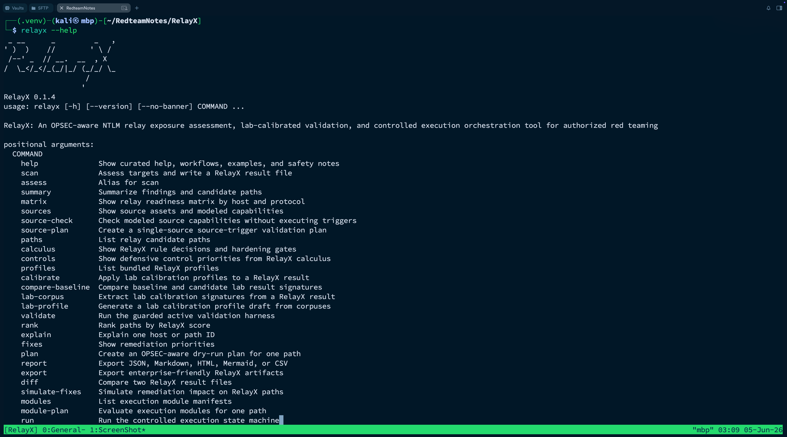

# RelayX

[English](../README.md) | [中文](README.zh-CN.md) | [Français](README.fr.md)

**Outil OPSEC-aware d'evaluation d'exposition NTLM relay, de validation calibree en laboratoire et d'orchestration d'execution controlee pour red teaming autorise.**


RelayX est un outil Python OPSEC-aware pour les evaluations red team et les
audits de securite autorises. Il combine l'evaluation d'exposition NTLM relay,
la validation calibree en laboratoire et l'orchestration d'execution controlee
sur les services entreprise courants. Il modele les chemins source-to-target,
classe ces chemins selon les preuves et le risque operationnel, enregistre les
decisions de validation controlee et exporte les resultats pour les operateurs,
les equipes defensives et les rapports.

RelayX s'inspire d'Impacket `ntlmrelayx` et de l'ecosysteme public de recherche
NTLM relay. Il ne cherche pas a remplacer ces projets. Son role est de reunir
la readiness relay, la priorisation des chemins, la calibration en laboratoire,
le controle d'execution et l'analyse de remediation dans un meme modele de
preuves.

Par defaut, RelayX ne capture pas d'identifiants, ne relaie pas
l'authentification NTLM et n'execute pas de coercition cote source. Les probes
cote cible restent orientes readiness. La validation synthetic authentication
est optionnelle, explicite, et peut generer de la telemetrie de connexion en
echec.

<p align="center">
  
</p>

## Capacites

- Evaluation readiness pour SMB signing, HTTP/HTTPS NTLM, LDAP/LDAPS et MSSQL
  TDS/SSPI.
- Preuves NTLM Type1/Type2 challenge-flow pour HTTP, LDAP/LDAPS et MSSQL sans
  soumettre d'identifiants.
- Negociation TDS-wrapped TLS pour MSSQL et preuve `tls-server-end-point` CBT
  lorsque le TLS serveur aboutit.
- Validation synthetic Type3 optionnelle pour observer les semantiques de rejet
  HTTP, LDAP/LDAPS et MSSQL dans un cadre autorise.
- Classification conservative des reponses via des evidence keys partagees,
  avec raisonnement cible pour EPA, LDAP signing, LDAPS CBT et MSSQL
  encryption/EPA.
- Durcissement des oracles protocole avec response subclassification, policy
  inference, signatures oracle nettoyees, observations normalisees et
  remaining uncertainty pour calibration et diff.
- Modelisation de capacites source pour WebClient/WebDAV, Spooler, EFSRPC,
  DFSNM, FSRVP, MSSQL outbound authentication, ADIDNS, ghost SPN et
  name-resolution inducement.
- Construction de chemins source-to-target avec scope guardrails, route/pivot
  awareness, noise filtering, blockers, fixes et notes OPSEC.
- Route/Pivot Awareness pour source sessions, segments, subnets, `route_hops`
  structures, Ligolo, Sliver P2P, SOCKS, tun2socks, port forwarding, hop count,
  reachability state, route risk scoring et checks direct TCP autorises qui
  n'ouvrent pas de pivot session.
- Relay decision calculus avec rule IDs, target families, preconditions,
  hardening gates, controles defensifs et priorites de remediation.
- Profils de lab calibration pour HTTP/IIS EPA, AD CS Web Enrollment EPA, LDAP
  signing, LDAPS CBT et les etats MSSQL encryption/EPA.
- Comparaison de baselines laboratoire, avec explication des promotions
  possibles et des cas qui doivent rester conservateurs.
- Extraction de lab signature corpus et generation de drafts de calibration
  profile pour les exercices red/blue reproductibles.
- Revue de provenance des lab corpuses pour distinguer synthetic fixtures,
  captures lab autorisees, metadonnees endpoint build, drift baselines et
  decisions operateur de promotion.
- Validation et execution records controles en modes dry-run, armed et
  confirmed, avec contexte operateur, controles timebox/noise/scope et audit
  logs JSONL.
- Planification de validation source pour WebClient/WebDAV, surfaces RPC
  coercion, MSSQL outbound authentication et chemins name-resolution sans
  executer de source trigger.
- Evaluation de politiques OPSEC pour validation, execution et source
  planning, avec noise ceilings, exigences de scope, contexte confirmed-mode,
  limites network-action, expected telemetry et rollback checks.
- Operation controls pour assessment et validation, avec rate limit, delay,
  jitter, fenetres planifiees, contrats scope listener/callback et preservation
  des sorties machine-clean.
- Inventaire de modules d'execution, planification de compatibilite et Adapter
  SDK dispatch, avec adaptateur integre d'audit hors ligne, definitions de
  modules via JSON manifest, credential policy guardrails, listener policy
  guardrails, fixtures lab-only qui bloquent en mode confirmed, contrats
  one-shot/timeout/evidence-capture et adapter lifecycle auditable.
- Validation versionnee des schemas et du contrat evidence pour resultats,
  profils lab, corpuses, lab provenance reports, execution records, evidence
  reports, module manifests, OpenGraph, JSONL, CSV, OPSEC policy et route
  report.
- Planification de standard lab matrix et verification de couverture corpus
  pour les etats HTTP/IIS EPA, AD CS Web Enrollment EPA, LDAP signing, LDAPS
  CBT et MSSQL encryption/EPA.
- Analyse des lab response differentials pour comparer des signatures stables
  de policy states et separer les vrais response discriminators des champs de
  contexte.
- Evidence completeness reporting pour auditer les records finding/path, les
  champs de protocol judgement, la source taxonomy, la distribution de
  confidence, les contract keys manquantes et l'incertitude restante.
- Exports entreprise pour graph analysis, ingestion SIEM, revue CSV, rapports
  HTML/Markdown, scan diff et simulation d'impact de remediation.
- Generation d'enterprise bundle avec manifest, hashes d'artefacts, schema
  status, route report optionnel et metadonnees de handoff release-ready.
- Quality gates CI/release pour package metadata, schema contracts, fixtures
  JSON, documentation entreprise, GitHub workflows, wheel builds et install
  smoke tests.
- Alias courts pour les flags CLI courants, avec une aide guidee qui explique
  quand les formes courtes sont pratiques et quand les options longues restent
  plus claires.

## Installation

RelayX requiert Python 3.11 ou plus recent.

```bash
git clone https://github.com/RedteamNotes/RelayX.git
cd RelayX

python3 -m venv .venv && source .venv/bin/activate
python -m pip install --upgrade pip
python -m pip install -e .

relayx --version
```

Pour une installation CLI utilisateur :

```bash
pipx install git+https://github.com/RedteamNotes/RelayX.git
relayx --version
```

## Demarrage rapide

Executer une evaluation cible et ecrire un fichier resultat RelayX :

```bash
relayx scan --targets examples/targets.txt --out result.json
relayx summary result.json
relayx matrix result.json
```

Ajouter des sources, une politique de scope et un profil workflow entreprise :

```bash
relayx scan \
  --profile enterprise \
  --targets examples/targets.txt \
  --sources examples/sources.csv \
  --scope examples/scope.txt \
  --out result.json
```

Examiner les chemins relay, decisions, controles et remediations :

```bash
relayx paths result.json
relayx routes --result result.json
relayx routes --result result.json --target-protocol ldap --connect-check --rate-limit 60 --format json --out relayx-routes.json
relayx calculus result.json
relayx evidence-report --result result.json
relayx controls result.json
relayx fixes result.json
relayx plan result.json PX-0001 --format json --out plan.json
```

Lancer une validation controlee ou un enregistrement d'execution hors ligne :

```bash
relayx validate --result result.json --path-id PX-0001 --mode dry-run
relayx validate --result result.json --path-id PX-0001 --mode confirmed --confirm --operator redpen --reason "authorized target reprobe" --audit-log audit.jsonl --scope filesrv01 --reprobe --stop-before 2030-01-01T18:00:00+08:00
relayx run --result result.json --path-id PX-0001 --module relayx_audit_record --mode confirmed --confirm --operator redpen --reason "authorized offline audit record" --audit-log audit.jsonl --scope filesrv01
```

Exporter des artefacts entreprise :

```bash
relayx export --result result.json --format opengraph --out relayx-opengraph.json
relayx export --result result.json --format jsonl --out relayx-events.jsonl
relayx bundle --result result.json --out-dir relayx-bundle
relayx diff old-result.json new-result.json --format json --out relayx-diff.json
relayx simulate-fixes result.json --control smb_signing --format json
relayx quality-gate --project-root .
```

Valider les schemas et le contrat evidence :

```bash
relayx schema list
relayx schema validate result.json
relayx schema validate --kind lab-profile fixtures/lab_profiles
```

## Tutoriel Complet

RelayX inclut un tutoriel hors ligne complet qui couvre le result model, le
classement des chemins, la route awareness, la calibration, la validation
controlee, l'audit d'execution hors ligne, les exports entreprise, le diff, la
simulation de remediation et la validation de schema sans toucher un reseau
live :

```bash
relayx -q summary examples/tutorial/sample-result.json
relayx -q paths examples/tutorial/sample-result.json -b
relayx -q bundle -r examples/tutorial/sample-result.json -d /tmp/relayx-tutorial-bundle
```

Le runbook complet est dans [docs/TUTORIAL.md](TUTORIAL.md). Les fixtures du
tutoriel se trouvent dans [examples/tutorial](../examples/tutorial).
Les attentes d'integration-test pour les labs autorises AD/IIS/AD CS/MSSQL sont
dans [docs/INTEGRATION_TESTS.md](INTEGRATION_TESTS.md).

## Reference des commandes

```text
relayx scan              Evalue les cibles et ecrit un resultat RelayX
relayx assess            Alias de scan
relayx summary           Resume les findings et chemins candidats
relayx matrix            Affiche la readiness par host et protocole
relayx sources           Affiche les sources et capacites modelisees
relayx source-check      Verifie les capacites source sans trigger
relayx source-plan       Cree un plan de validation source-trigger
relayx routes            Evalue la reachability route et pivot
relayx paths             Liste les chemins relay candidats
relayx calculus          Affiche decisions de regles et hardening gates
relayx controls          Affiche les priorites de controles defensifs
relayx calibrate         Applique des profils de lab calibration
relayx compare-baseline  Compare signatures baseline et candidate
relayx lab-matrix        Affiche la standard lab policy matrix RelayX
relayx lab-corpus        Extrait des signatures lab depuis un resultat
relayx lab-verify        Verifie les corpuses lab contre la matrice standard
relayx lab-provenance    Audite provenance corpus et review readiness
relayx lab-stability     Evalue stabilite et drift des captures lab repetees
relayx lab-diff          Compare les response differentials entre policy states
relayx lab-index         Resume les corpuses de signatures lab
relayx lab-profile       Genere un draft de calibration profile depuis corpus
relayx evidence-report   Audite evidence completeness, source taxonomy et judgement
relayx validate          Lance une validation active controlee pour un chemin
relayx profiles          Liste les profils RelayX integres
relayx export            Exporte graph, JSONL, CSV, rapport ou diagramme
relayx bundle            Ecrit un enterprise handoff bundle valide
relayx diff              Compare deux resultats RelayX
relayx simulate-fixes    Simule l'impact des remediations sur les chemins
relayx quality-gate      Lance les quality gates CI et release locaux
relayx schema            Liste ou valide schemas et contrats evidence
relayx opsec             Liste ou inspecte les politiques OPSEC
relayx modules           Liste les manifests de modules d'execution
relayx module-plan       Evalue les modules d'execution pour un chemin
relayx run               Lance la machine d'etats d'execution controlee
relayx console           Lance une console operateur locale avec contexte
relayx completion        Genere les completions bash, zsh ou fish
relayx rank              Classe les chemins par impact, confiance et cout OPSEC
relayx explain           Explique un host ou un chemin
relayx fixes             Affiche les priorites de remediation
relayx plan              Cree un plan dry-run OPSEC-aware pour un chemin
relayx report            Exporte JSON, Markdown, HTML, Mermaid ou CSV
```

RelayX inclut aussi des rubriques d'aide guidees :

```bash
relayx help
relayx help getting-started
relayx help commands
relayx help workflows
relayx help exports
relayx help short-options
relayx help safety
relayx help calibration
relayx help execution
relayx help enterprise
relayx help troubleshooting
relayx help completion
relayx help scan
relayx help run --format json
relayx help schema
relayx --no-banner help
```

Les sorties lisibles par un humain affichent une banniere RelayX avec la version
courante. Utilisez `--no-banner` pour une sortie compacte. Les payloads JSON,
CSV, HTML, Markdown, Mermaid et enterprise export restent propres pour les
pipelines.

## Options courtes

Les options frequentes disposent d'alias courts. Les options longues restent
preferables dans les runbooks partages et les scripts; les alias courts sont
utiles pour le travail interactif.

```bash
relayx scan -t examples/targets.txt -s examples/sources.csv -S examples/scope.txt -o result.json
relayx validate -r result.json -p PX-0001 -m dry-run
relayx export -r result.json -f jsonl -o relayx-events.jsonl
relayx bundle -r result.json -d relayx-bundle -F opengraph,jsonl,csv
relayx quality-gate -C . -f json -o relayx-quality-gate.json
```

Utilisez `relayx help short-options` pour la carte des alias. Les alias
sensibles comme `-A/--auth-validation`, `-y/--confirm` et
`-P/--opsec-policy` ne changent pas les guardrails: RelayX continue d'exiger
operator, reason, scope, audit et adapter policy.

## Console Operateur Et Completion

`relayx console` est une console operateur locale, mono-processus, pour
travailler plusieurs fois sur le meme result, path, OPSEC policy et scope.
Ce n'est pas un client C2: elle ne lance pas de listener, pivot session,
source trigger ou live relay adapter. Les commandes de la console appellent
les memes handlers CLI et conservent les memes guardrails.

```bash
relayx console --result result.json --path-id PX-0001 --opsec-policy strict
relayx completion zsh > relayx.zsh
relayx help getting-started
```

Dans la console, utilisez `use result <file>`, `use path PX-0001`, `set
opsec-policy strict`, `show summary`, `show paths`, `explain`, `validate`,
`run`, `export`, `bundle`, `help`, `back` et `exit`.

## Formats de sortie

- `json` : resultat RelayX complet ou sortie de commande pour l'automatisation.
- `markdown` / `html` : rapports d'evaluation pour operateurs et
  stakeholders; les rapports HTML filtrent hors ligne par status, severity,
  protocol, source capability, target family, defensive control et texte libre.
- `mermaid` : diagrammes de chemins legers.
- `csv` : revue findings/path dans un tableur avec contrat de champs stable.
- `jsonl` : un evenement par ligne pour SIEM et pipelines blue team, avec
  event IDs et field contract versions stables.
- `opengraph` : graphe custom de style BloodHound/OpenGraph avec nodes et
  edges RelayX, mapping dans l'artefact, edge IDs deterministes et control
  nodes.
- `bundle-manifest` : manifest d'enterprise bundle avec hashes et schema
  status.
- `quality-gate` : rapport de gate CI/release pour package, fixtures, docs et
  workflows.

## Contrats de schema

RelayX inclut un validateur versionne de schemas et de contrat evidence :

```bash
relayx schema list --format json
relayx schema validate result.json --format json
relayx schema validate --kind module-manifest fixtures/execution_modules
```

Les kinds supportes incluent `result`, `evidence`, `lab-profile`, `lab-corpus`,
`lab-provenance`, `lab-stability`, `lab-differential`, `evidence-report`,
`execution-record`, `module-manifest`, `opsec-policy`, `route-report`,
`bundle-manifest`, `quality-gate`, `opengraph`, `jsonl` et `csv`.
Les rapports de validation expliquent les champs invalides par chemin et
renvoient un exit code `2` lorsque l'artefact ne respecte pas le contrat choisi.

`relayx diff` rapporte les paths added/removed/changed, ainsi que exposure
trend, score delta, control trends, remediation regressions et remediation
improvements. `relayx simulate-fixes` rapporte affected paths, control
dependencies, remaining controls, remaining target families et estimated
residual exposure.

`relayx evidence-report -r result.json` audite un resultat existant hors ligne,
sans trafic reseau. Il signale les records candidate/relayable sans evidence,
les protocol judgement records sans policy inference ou remaining uncertainty,
les evidence entries qui gardent une confidence `unknown`, et les categories de
source comme wire observation, policy inference, lab calibration, source model,
route model, control mapping et operator context.

## Calibration laboratoire

RelayX reste volontairement conservateur lorsque les preuves reseau sont
ambigues. Les profils de lab calibration permettent de mapper des etats de
politique controles vers les signatures observees par RelayX :

```bash
relayx calibrate result.json --profiles fixtures/lab_profiles --annotate-out calibrated-result.json
relayx compare-baseline --baseline epa-off.json --candidate epa-required.json --profiles fixtures/lab_profiles
relayx lab-matrix --target-family mssql_epa --format json --out lab-matrix.json
relayx lab-verify --corpus fixtures/lab_corpus --format json --out lab-verify.json
relayx lab-provenance --corpus fixtures/lab_corpus --format json --out lab-provenance.json
relayx lab-stability --corpus fixtures/lab_corpus --min-captures 2 --format json --out lab-stability.json
relayx lab-diff --corpus fixtures/lab_corpus --target-family http_iis_epa --format json --out lab-diff.json
relayx lab-corpus result.json --label iis-epa-required --policy-state epa_required --expected-state epa_or_cbt_enforcement_signal --promotion promote --format json --out corpus.json
relayx lab-profile --corpus corpus.json --profile-id http_iis_epa_lab --target-family http_iis_epa --service http --format json --out profile.json
```

RelayX ne promeut une conclusion que lorsque le profil et la difference de
baseline la justifient. Sinon, il conserve l'etat conservateur initial et
explique les preuves encore manquantes.

`lab-matrix`, `lab-verify`, `lab-provenance`, `lab-stability`, `lab-diff`,
`lab-corpus` et `lab-profile` sont des aides de recherche hors ligne. Ils ne
generent pas de trafic reseau; ils transforment des resultats RelayX deja
captures en corpuses de signatures, verifient la couverture contre la matrice
standard, auditent la provenance et la review readiness, mesurent la stabilite
et le drift des captures repetees, comparent les response discriminators entre
etats de politique stables, et generent des drafts de profiles a reviser. Les
synthetic fixtures servent aux tests de pipeline et aux exemples, mais RelayX
ne les traite pas comme preuve de promotion issue d'un vrai lab. `lab-diff`
travaille sur les etats stables d'un corpus; utilisez `compare-baseline` pour
comparer deux fichiers resultat RelayX.

## Frontiere de securite

RelayX est destine uniquement aux systemes que vous possedez ou que vous etes
explicitement autorise a evaluer. L'evaluation par defaut ne relaie pas
d'identifiants et n'execute pas de coercition cote source. `--auth-validation`
envoie des messages synthetic NTLM authenticate avec des identifiants
placeholder et peut generer de la telemetrie d'authentification en echec.

La validation et l'execution confirmed exigent une identite operateur, une
raison, une confirmation et un audit log; l'execution confirmed exige aussi un
scope explicite. L'adaptateur d'execution integre et supporte est uniquement un
enregistrement d'audit hors ligne. L'execution est
dispatch via le RelayX Adapter SDK, qui bloque les adaptateurs non enregistres,
les politiques credential non sures, les politiques listener non sures et les
declarations manifest incoherentes. Les adaptateurs live relay ne sont pas
actives par defaut.

## Remerciements

RelayX est informe par la recherche publique NTLM relay et par des outils comme
Impacket `ntlmrelayx`, NetExec, les recommandations de durcissement Microsoft
et les specifications de protocoles Microsoft, etc. RelayX reimplemente sa
propre logique et n'integre pas directement de code GPL provenant de ces
projets.
